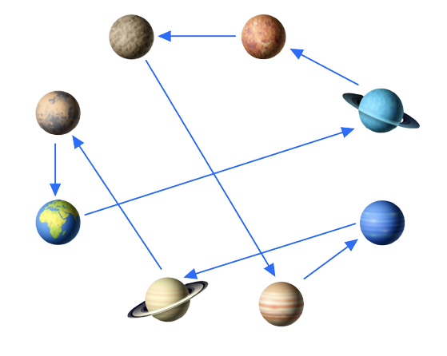
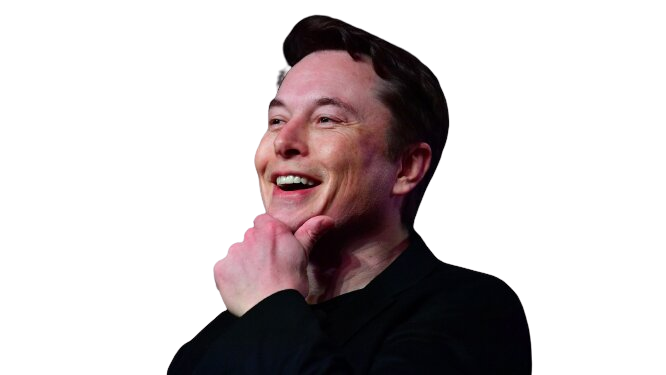

# Traveling Salesman Problem

> This is a project created for the final project of the Decision Science subject of the Master's Degree in Computer science of the [University of Cagliari](https://www.unica.it/unica/en/homepage.page).

# About 
TSP is a classic optimization problem in computer science and operations research. The problem is defined as follows:

Given a set of cities and the distances between each pair of cities, the objective is to find the shortest possible route that allows a salesperson to visit each city exactly once and return to the starting city.

The TSP is classified as an NP-hard problem, which means that it is computationally difficult to find an optimal solution for large instances of the problem. As the number of cities increases, the number of possible routes grows exponentially, making it infeasible to brute-force all possibilities.

In this essay, we playfully apply TSP to the case where Elon Musk, the visionary entrepreneur of SpaceX, wishes to visit all the planets of our solar system. Each path between planets has an associated cost. The goal is to find the overall route that allows Elon Musk to visit all planets while reducing the cost as much as possible.




<div wigth="100%">

<div>

## Getting Started

```bash
cd Python
```

```bash
python3 -m venv venv
source venv/bin/activate
```

```bash
pip install -r requirements.txt
```

```bash
python3 main.py
```

## Resources

- [PyCharm Project](TSP_PyCharm)

- [PDF](TSP_come_Guida_tra_i_Pianeti.pdf)
